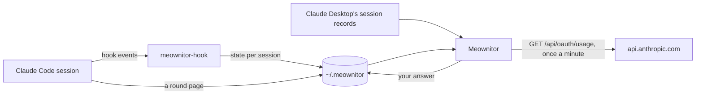

<div align="center">

<picture>
  <source media="(prefers-color-scheme: dark)" srcset="docs/screenshots/hero-dark.png">
  
</picture>

[](https://github.com/kartatyi/meownitor/releases/latest)
[](https://github.com/kartatyi/meownitor/actions/workflows/ci.yml)


[](LICENSE)

**[Download](https://github.com/kartatyi/meownitor/releases/latest)** ·
[What it does](#what-it-does) ·
[Install](#install) ·
[How it works](#how-it-works) ·
[Українською](README.uk.md)

</div>

**Meownitor** sits in a corner of your screen and tells you at a glance which of your Claude Code
sessions is waiting for you, which one is still working and on what, and how much of your plan is
left. It also lets Claude ask you questions with pictures instead of a wall of text.

> [!NOTE]
> Meownitor is an unofficial community project. Anthropic does not make, endorse or support it.

## What it does

<table>
<tr>
<td width="54%" valign="top">

### Sessions at a glance

Every Claude Code session of the last day, from a terminal or from Claude Desktop, grouped by what it
needs from you:

- **Waiting for you**: a question, a permission prompt, a question round;
- **Working**, and on what: the command, the file being edited, the search;
- **Your turn**: the turn is over, the ball is in your court;
- **Idle**, folded away.

A click on a Desktop session opens it there. The pet's mood follows the sessions, and it chirps once
when a session starts waiting for you.

### Plan limits

The 5-hour and the weekly limit with their reset times, the same numbers `/usage` shows. Past 85% the
pet looks tired.

### Questions with pictures

With the bundled [`meownitor-round`](skill/meownitor-round/SKILL.md) skill, a session draws its options on
one page and waits: layouts, designs, diagrams, a render with the changes framed and numbered. The
widget chirps, you pick and comment in a window, and the answer goes straight back to the session.

</td>
<td width="46%" align="center" valign="top">

<picture>
  <source media="(prefers-color-scheme: dark)" srcset="docs/screenshots/card-dark.png">
  
</picture>

</td>
</tr>
</table>

### A pet with moods

<picture>
  <source media="(prefers-color-scheme: dark)" srcset="docs/screenshots/moods-dark.png">
  
</picture>

A cat, a blob or a ghost. It follows the cursor with its eyes, likes being petted (wiggle the pointer
over it), falls asleep when nothing happens for a while and lets clicks through its transparent
pixels. Drag it anywhere. Drop it at the left or right screen edge and it turns into a thin strip that
slides the card out when you hover over it.

### Ask with pictures

<picture>
  <source media="(prefers-color-scheme: dark)" srcset="docs/screenshots/round-dark.png">
  
</picture>

### Settings on the back of the card

<table>
<tr>
<td width="50%" align="center">
<picture>
  <source media="(prefers-color-scheme: dark)" srcset="docs/screenshots/settings-dark.png">
  
</picture>
</td>
<td width="50%" align="center">
<picture>
  <source media="(prefers-color-scheme: dark)" srcset="docs/screenshots/card-uk-dark.png">
  
</picture>
</td>
</tr>
</table>

The gear turns the card over: the character, English or Ukrainian, the ask sound, start at login,
and the Claude Code hook, which you install or remove with one click.

## Install

**Needs:** [Claude Code](https://code.claude.com/docs/en/overview) and one of:

- **Windows** 10 or 11 (WebView2 is built in);
- **macOS** 11 or later, Apple silicon or Intel. *Experimental:* it has run on a Mac built from
  source (macOS 26.3, Apple silicon), while the release's disk image has so far only been built and
  started in CI, so [reports](https://github.com/kartatyi/meownitor/issues) are welcome;
- **Linux** x86-64 with a compositing desktop (for the transparent window) and a tray; on GNOME that
  takes the [AppIndicator extension](https://extensions.gnome.org/extension/615/appindicator-support/).
  Under Wayland the widget runs through XWayland, since Wayland lets no window place itself.

Claude Desktop is optional: it adds session titles and the open-in-Desktop link. There is no Claude
Desktop for Linux, so there the widget shows the sessions you run in a terminal.

1. Get the package for your system from the **[latest release](https://github.com/kartatyi/meownitor/releases/latest)**:

   | System | File | Then |
   |---|---|---|
   | Windows | `Meownitor_<version>_x64-setup.exe` | run it; it installs for your user only, no admin rights |
   | macOS | `Meownitor_<version>_universal.dmg` | open it and drag Meownitor to Applications |
   | Debian, Ubuntu | `Meownitor_<version>_amd64.deb` | `sudo apt install ./Meownitor_<version>_amd64.deb` |
   | Fedora, openSUSE | `Meownitor_<version>_x86_64.rpm` | `sudo dnf install ./Meownitor_<version>_x86_64.rpm` |
   | Any Linux | `Meownitor_<version>_amd64.AppImage` | `chmod +x` it and run it |

   > [!TIP]
   > Nothing is signed with a paid certificate. On Windows, SmartScreen may say it does not recognise
   > the app: **More info → Run anyway**. On macOS the first start is refused: open
   > **System Settings → Privacy & Security** and press **Open Anyway** next to Meownitor, or run
   > `xattr -dr com.apple.quarantine /Applications/Meownitor.app`. Every release lists the files'
   > SHA-256 in `SHA256SUMS.txt`.

2. The pet appears in the bottom-right corner. Click it to open the card, then click the gear ⚙.
3. **Claude Code hook → Install.** This adds the widget's hook to `~/.claude/settings.json`. Your other
   hooks stay as they are, and a backup of the file goes next to it. A session shows up on the next
   thing it does.
4. For the plan limits, sign in to Claude Code once: run `claude`, then `/login`. On macOS the widget
   reads that sign-in from the Keychain, and macOS may ask once to let `security` read
   «Claude Code-credentials»: **Always Allow**.
5. *Optional, for questions with pictures:* unzip `meownitor-round-skill.zip` from the release into
   `~/.claude/skills/` (`%USERPROFILE%\.claude\skills\` on Windows), so that you have
   `~/.claude/skills/meownitor-round/SKILL.md`. Claude Code picks the skill up in new sessions.

**Portable on Windows:** unzip `Meownitor_<version>_x64-portable.zip` anywhere, run `meownitor.exe`
and follow steps 2–5.

### Using it

| | |
|---|---|
| Click the pet | open the card |
| `–` in the card's header | back to just the pet |
| Drag the pet, the card's header or the strip | move it; it snaps to a screen edge |
| Drop it at the left or right edge | dock it as a strip; hover over it to slide the card out |
| Click a session | open it in Claude Desktop (sessions Desktop knows) |
| **Answer** on a session | open its question round |
| ⚙ | the settings |
| The tray icon (the menu bar on macOS) | try the moods and characters, quit |

### Uninstall

**Windows:** Settings → Apps → **Meownitor** → Uninstall. This takes the hook out of
`~/.claude/settings.json` and turns off start with Windows. Tick **Delete the application data** to
also remove `~/.meownitor`. Install it again and the hook and start with Windows come back by
themselves.

**macOS and Linux:** removing the app can't reach your settings, so first open ⚙, press
**Claude Code hook → Remove** and turn autostart off. Then quit from the tray and remove the app:
drag it from Applications to the Trash, run `sudo apt remove meownitor` or `sudo dnf remove meownitor`,
or delete the AppImage. `~/.meownitor` holds the widget's data; delete it too if you like.

## How it works



- **Sessions.** `meownitor-hook` is a [Claude Code hook](https://code.claude.com/docs/en/hooks)
  on 11 events. For each event it writes what the session is doing into
  `~/.meownitor/sessions/<id>.json` and exits within milliseconds. It never blocks Claude
  or fails it. The widget merges those files with Claude Desktop's own session records (titles,
  archived or not, the `claude://` link) and with the session's transcript, which is how it sees a
  turn you stopped. The folder is `~/.meownitor` on every system. On Windows it is not in AppData
  because Claude Desktop there is an MSIX package: everything it starts sees AppData through the
  package's own copy, so a session in Desktop and one in a terminal would write to different places.
- **Limits.** Once a minute the widget makes the request Claude Code's `/usage` makes. It is an account
  query, not a model call, so it costs nothing against your limits. It uses Claude Code's sign-in from
  `~/.claude/.credentials.json` and refreshes the token the way Claude Code does. On macOS, Claude Code
  keeps the sign-in in the Keychain instead, and there the widget only reads it: once that token
  expires, the card keeps its last numbers (with none yet, it says it is waiting for Claude Code)
  until Claude Code next runs and renews the sign-in. When the server is busy, the last numbers stay on the card and
  the requests come less often.
- **Questions.** A session writes one HTML page into its round folder (`meownitor-hook where`) and
  runs `meownitor-hook wait <name>` in the background. The widget serves the page in a window of
  its own. When you press **Send**, the answer lands next to the page and the waiting command hands it
  back to the session. It waits up to a day; an answer sent after it stopped reaches the session with
  your next message to it. When you answer in the chat instead, the session takes the question back
  (`meownitor-hook drop <name>`) and the widget stops asking. The skill's [`SKILL.md`](skill/meownitor-round/SKILL.md) is the full contract.

### Privacy

- Everything stays on your machine. The only network traffic goes to Anthropic: the usage request,
  plus a token refresh when Claude Code's sign-in is about to expire (written back to
  `~/.claude/.credentials.json`, as Claude Code does it; never on macOS, where the Keychain is only
  read). Tokens are never logged.
- No telemetry and no analytics.
- The hook records each session's state, the current tool's name and one short detail: the file's
  name, the command's description, the search pattern. `events.log` keeps the last 512 KB of event
  names.
- `~/.claude/settings.json` is changed only when you press Install or Remove, uninstall the app, or
  an update moves the hook's copy, and it is backed up first.

## Build from source

Needs [Rust](https://rustup.rs) and Node 20+, plus the MSVC build tools on Windows, the Xcode command
line tools on macOS, and these libraries on Debian or Ubuntu:

```bash
sudo apt install libwebkit2gtk-4.1-dev libayatana-appindicator3-dev librsvg2-dev libxdo-dev libssl-dev
```

```bash
cd app
npm install
cd src-tauri
cargo test
cargo build        # target/debug/meownitor and meownitor-hook (.exe on Windows)
```

The packages, the way the release workflow builds them: the hook first, then the bundle, which
carries it next to the widget (on Windows through `tauri.bundle.windows.conf.json`).

```bash
cd app
cargo build --release --bin meownitor-hook --manifest-path src-tauri/Cargo.toml
npx tauri build --bundles nsis --config src-tauri/tauri.bundle.windows.conf.json            # Windows
npx tauri build --bundles app,dmg            # macOS, this Mac's architecture
npx tauri build --bundles deb,rpm,appimage   # Linux
```

| Folder | What is in it |
|---|---|
| `app/src` | the widget's look: plain HTML and canvas. `pixel.js` is the sprite engine, `widget.js` the window modes, `i18n.js` the words |
| `app/src-tauri/src` | Rust: window geometry (`main.rs`), sessions, limits, question rounds, the hook's install and uninstall |
| `app/src-tauri/src/bin/hook.rs` | the Claude Code hook |
| `skill/meownitor-round` | the skill and its page kit |
| `docs` | the README pictures, rendered from the app's own pages on made-up data (`python docs/shoot.py`) |

For checks without the mouse, `MEOWNITOR_START` (`card`, `settings`, `dock-l`, `dock-r`,
`dock-r-open`), `MEOWNITOR_MOOD` and `MEOWNITOR_ROUND=<session id>/<round name>` set how the
widget starts.

### Releasing

1. Set the new version in `app/src-tauri/tauri.conf.json`, `app/src-tauri/Cargo.toml` and
   `app/package.json`, and add its section to [`CHANGELOG.md`](CHANGELOG.md).
2. Tag it and push the tag:

   ```bash
   git tag v0.2.0
   git push origin v0.2.0
   ```

   The [Release](.github/workflows/release.yml) workflow tests and builds on Windows, macOS and
   Linux, checks that every package holds both programs, and publishes the packages, the skill and
   the checksums with the version's changelog section as the notes. A tag with a `-`
   (`v0.2.0-beta.1`) becomes a pre-release. Run by hand with **publish** off, it builds any branch
   and leaves the packages as the run's artifacts, so they can be tried before tagging.

## Roadmap

- macOS: a Developer ID signature and notarization, so the first start needs no Open Anyway.
- Linux on ARM.

## Contributing

Bug reports, ideas and pull requests are welcome — see [CONTRIBUTING.md](CONTRIBUTING.md). Security issues: [SECURITY.md](SECURITY.md).

## License

[MIT](LICENSE) © 2026 Vladyslav Yurchenko
